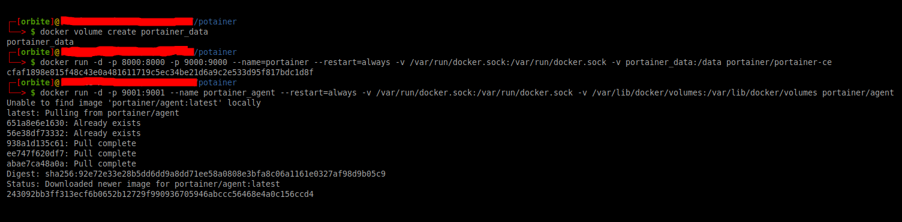

# Potainer-Docker
Potainer via repo oficial!

## Potainer :
## Work In Progess -->

* __Facilidade de gerenciar todo parque em docker ou k8s__
---

---
* __Configuração inicial__ 

1. __Documentção oficial__

 * Requisitos de Instalação
  - [Link](https://documentation.portainer.io/v2.0/deploy/requirements/)

 * Instalação do agent nas máquinas
  - [Link](https://documentation.portainer.io/v2.0/deploy/ceinstalldocker/) 

---

---  

2. __Portainer Server Deployment__  

  ```
  docker volume create portainer_data

  docker run -d -p 8000:8000 -p 9000:9000 --name=portainer --restart=always -v /var/run/docker.sock:/var/run/docker.sock -v portainer_data:/data portainer/portainer-ce

  ```
---

---

3. __Portainer Agent Only Deployment__
  ```
  docker run -d -p 9001:9001 --name portainer_agent --restart=always -v /var/run/docker.sock:/var/run/docker.sock -v /var/lib/docker/volumes:/var/lib/docker/volumes portainer/agent
  
  ```
---

---

4. __Exemplo dos comandos de instalação__



---

---

5. __Container Start automatico na inicialização__

 * ! 

[Link](https://www.youtube.com/watch?v=GWq86TF2jss&t=1398s)

```
docker update --restart=always #colocar id do container aqui

#exemplo

┌─[orbite]:~/-GIT/potainer
└──> $ docker ps
CONTAINER ID   IMAGE                    COMMAND        CREATED          STATUS          PORTS                                            NAMES
243092bb3ff3   portainer/agent          "./agent"      13 minutes ago   Up 13 minutes   0.0.0.0:9001->9001/tcp                           portainer_agent
cfaf1898e815   portainer/portainer-ce   "/portainer"   18 minutes ago   Up 3 minutes    0.0.0.0:8000->8000/tcp, 0.0.0.0:9000->9000/tcp   portainer

┌─[orbite]:~/-GIT/potainer
└──> $ docker update --restart=always 243092bb3ff3 cfaf1898e815
243092bb3ff3
cfaf1898e815

```

6. __Projeto atual usamos o docker-compose!__

```
┌─[orbite]:~/potainer
└──> $ docker-compose -f docker-compose-portainer.yml up -d
Creating network "potainer_default" with the default driver
Creating volume "potainer_portainer_data" with default driver
Creating portainer ... done

┌─[orbite]:~/-GIT/potainer
└──> $ docker ps
CONTAINER ID   IMAGE                    COMMAND                  CREATED         STATUS         PORTS                                NAMES
cc5f095448f9   portainer/portainer-ce   "/portainer -H unix:…"   4 seconds ago   Up 2 seconds   8000/tcp, 127.0.0.1:9000->9000/tcp   portainer

┌─[orbite]:~/-GIT/potainer
└──> $ docker update --restart=always cc5f095448f9
cc5f095448f9

┌─[orbite]:~/-GIT/potainer
└──> $ docker run -d -p 9001:9001 --name portainer_agent --restart=always -v /var/run/docker.sock:/var/run/docker.sock -v /var/lib/docker/volumes:/var/lib/docker/volumes portainer/agent
b42f070b9af989efc0fe6b0d9217c93bac59ceb1e4aac7d418a7c16389f73021

┌─[orbite]:~/-GIT/potainer
└──> $ docker ps
CONTAINER ID   IMAGE                    COMMAND                  CREATED              STATUS              PORTS                                NAMES
b42f070b9af9   portainer/agent          "./agent"                3 seconds ago        Up 2 seconds        0.0.0.0:9001->9001/tcp               portainer_agent
cc5f095448f9   portainer/portainer-ce   "/portainer -H unix:…"   About a minute ago   Up About a minute   8000/tcp, 127.0.0.1:9000->9000/tcp   portainer

┌─[orbite]:~/-GIT/potainer
└──> $ docker update --restart=always b42f070b9af9
b42f070b9af9

```
